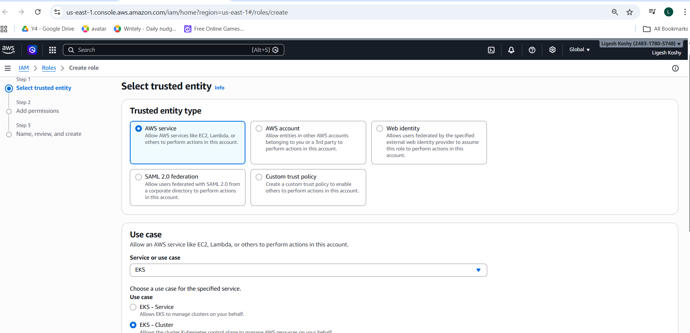
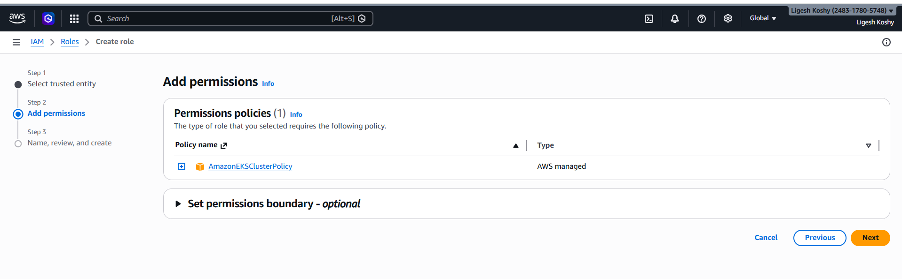
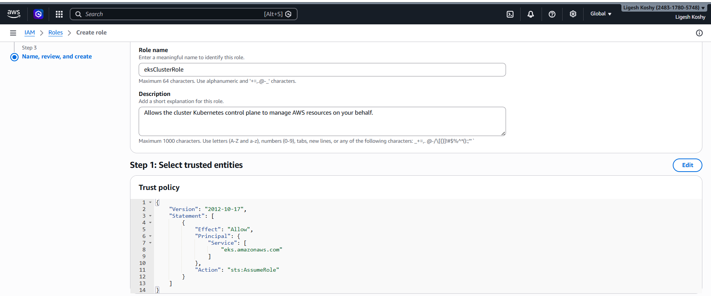
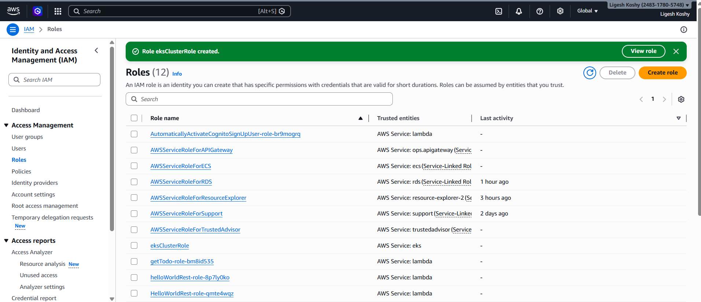
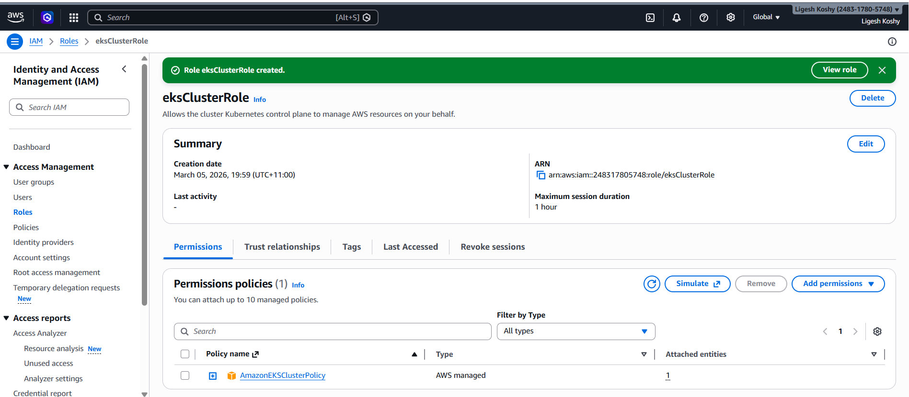
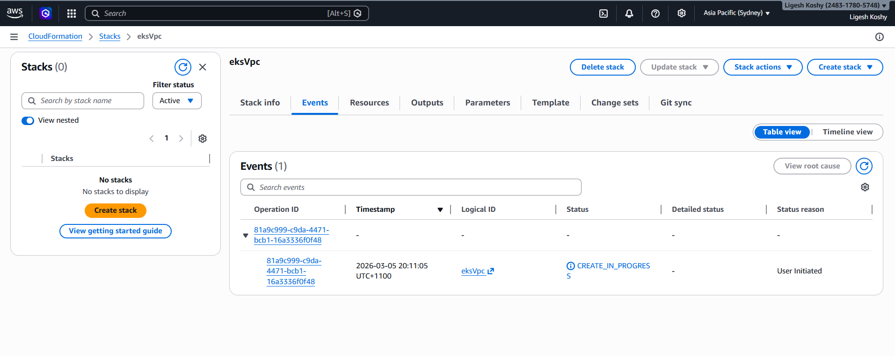
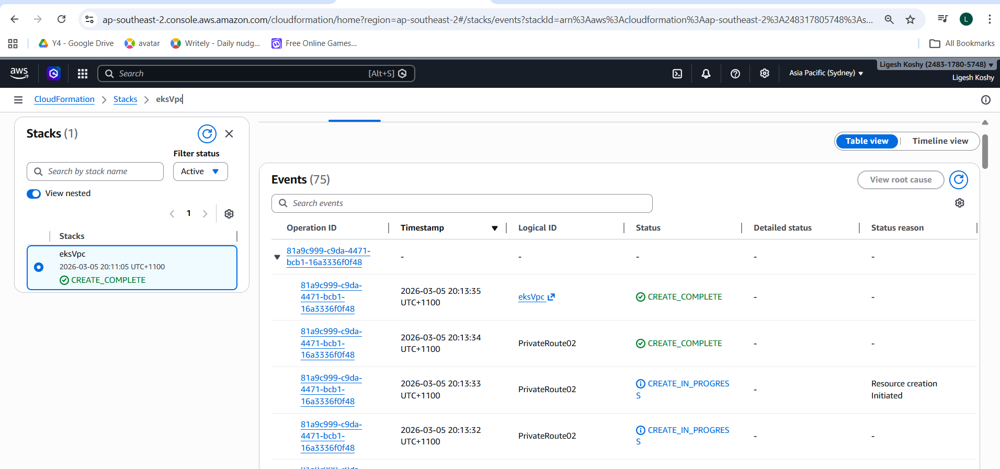
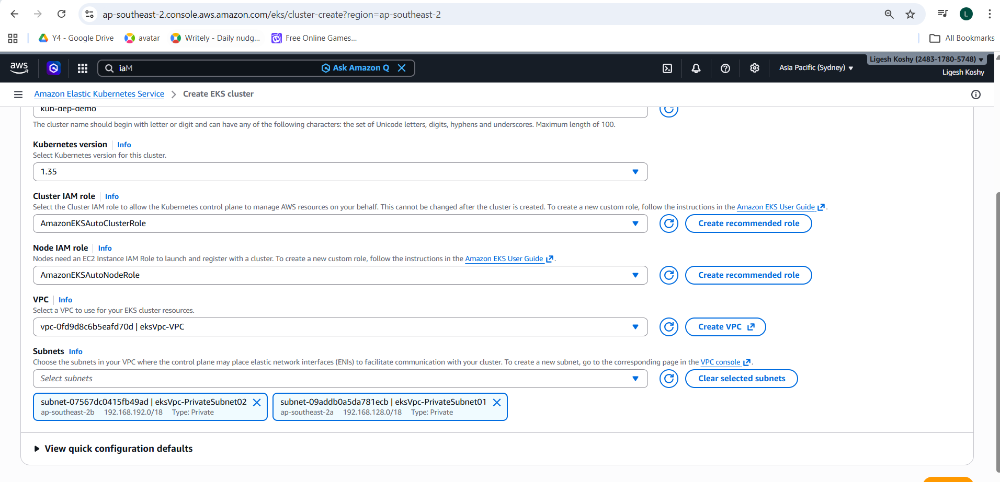
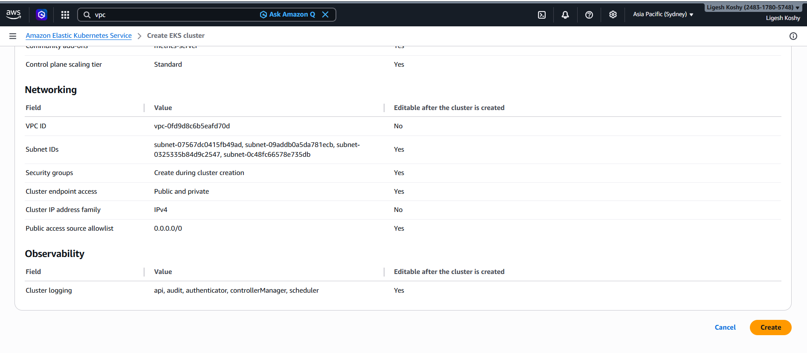

**AWS Configuration for EKS Setup**
IAM Role - EKS

Cloud Formation template to create VPC - EKS
Amazon Url :https://docs.aws.amazon.com/eks/latest/userguide/creating-a-vpc.html#create-vpc

VPC Created

EKS Created

Add Worker nodes
