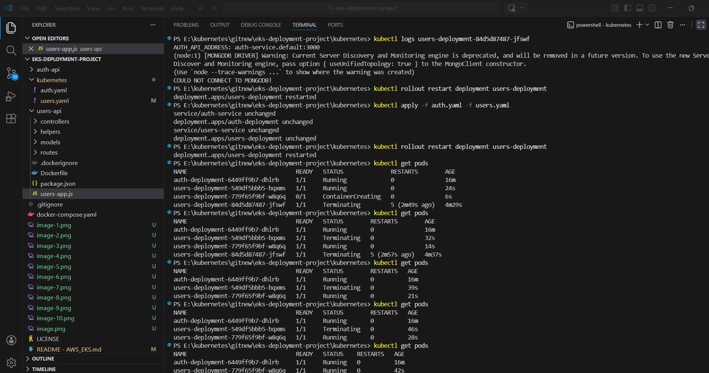
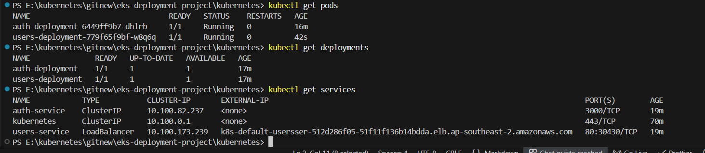
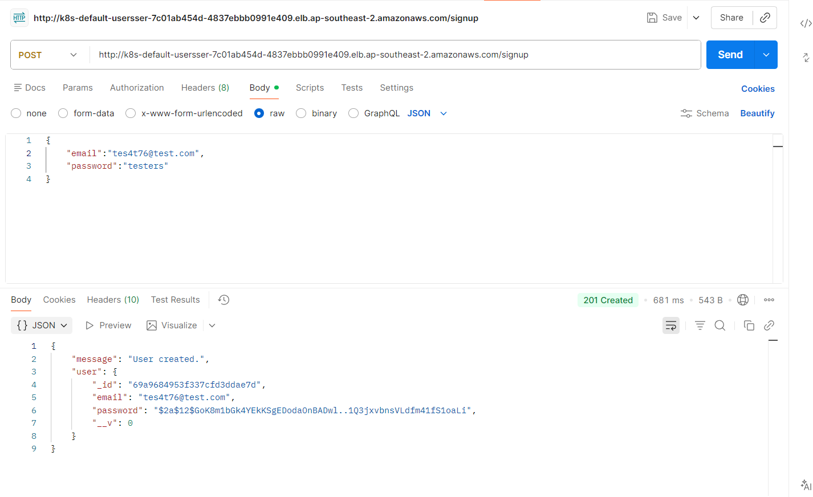
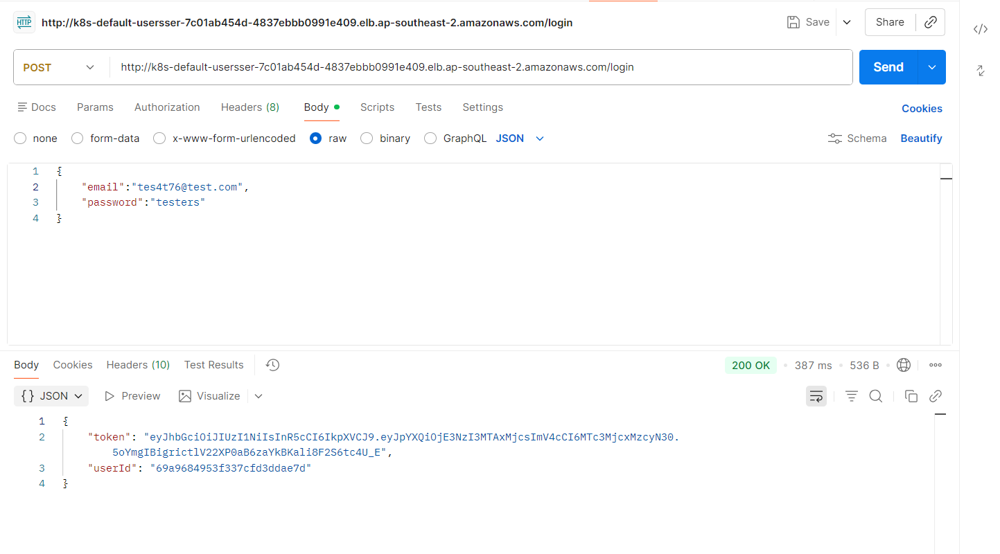
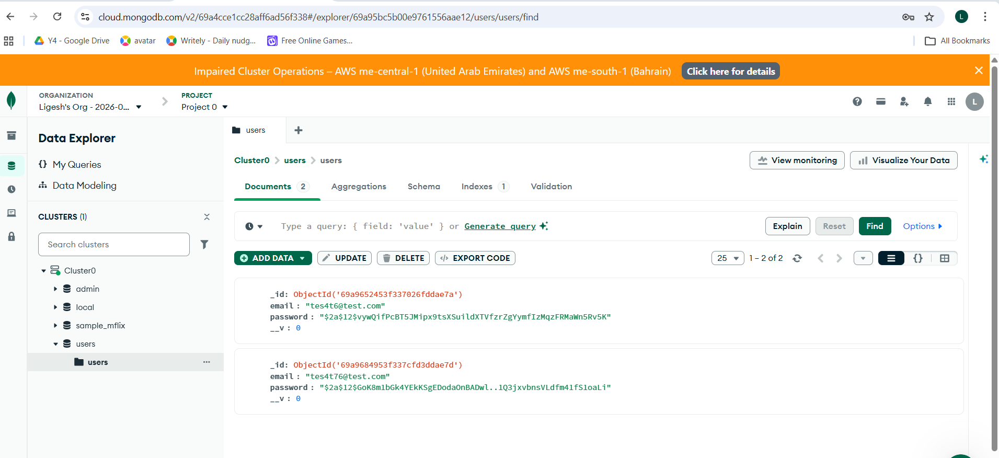

**Current Project Status: Fully Operational in AWS EKS**

When created EKS - VPC with stack, it created as internal. So postman timedout.
So, changed the config in users.yaml to make ELB public facing.

annotations:
service.beta.kubernetes.io/aws-load-balancer-type: "nlb"
service.beta.kubernetes.io/aws-load-balancer-scheme: "internet-facing"
service.beta.kubernetes.io/aws-load-balancer-backend-protocol: "http"

The API stated working in Postman.

So same configuration with Minikube worked with EKS, so addition AWS settings was added. Other than Load balancer made public.

Database - Mongo DB atlas - data inserted

